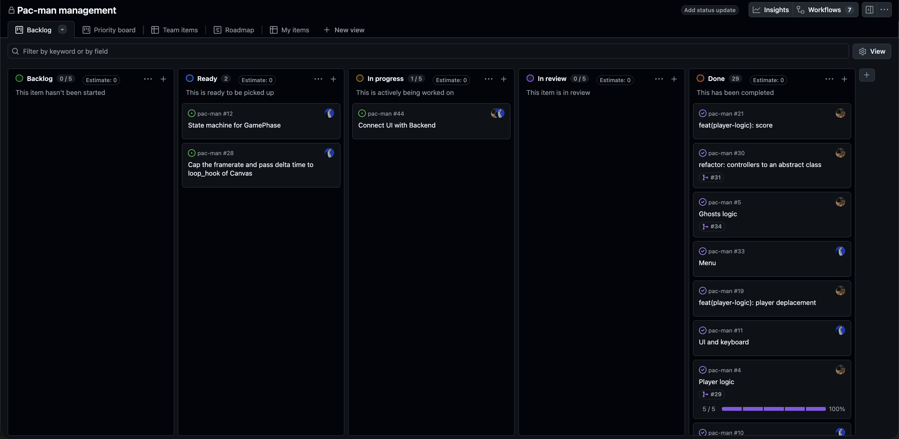

*This project has been created as part of the 42 curriculum by equentin, mchauvin.*

# Pac-man

## Description
The goal is to create a complete and playable Pac-Man game in Python, using
object-oriented programming, a simple graphical library, and a modular, reusable architecture.

## Instructions

## Configuration

**Comment Support**: You can annotate your configuration file using `#` at the beginning of any line to add notes or temporarily disable lines.  
**Automatic Recovery**: If a key is missing, misspelled, or set to an invalid value (e.g., negative lives or an extreme speed), the game will not crash. Instead, it logs a warning and automatically falls back to safe default settings.  
**Minimum Level Guarantee**: The game requires at least 10 levels. If fewer levels are specified in the file, the game automatically completes the list up to 10 using default dimensions.  

### Global Settings

| Setting | Type | Default | Allowed Range | Description |
| :--- | :---: | :---: | :---: | :--- |
| `highscore_filename` | Text | `"highscores.json"` | Valid filename | Name of the file where the top 10 scores are saved. |
| `lives` | Whole number | `3` | At least `1` | Number of lives the player starts with. |
| `level_max_time` | Whole number | `300` | At least `1` | Time limit to finish each level (in seconds). |
| `seed` | Whole number | `42` | Greater than `0` | Starting seed for procedural maze generation (Level 1). |

---

### Scoring Rules

| Setting | Type | Default | Allowed Range | Description |
| :--- | :---: | :---: | :---: | :--- |
| `points_per_pacgum` | Whole number | `10` | 0 or more | Points awarded when eating a standard dot. |
| `points_per_super_pacgum` | Whole number | `50` | 0 or more | Points awarded when eating a large power pellet. |
| `points_per_ghost` | Whole number | `200` | 0 or more | Points awarded when eating a vulnerable (blue) ghost. |

---

### Speeds & Timers (Game Balance)

| Setting | Type | Default | Allowed Range | Description |
| :--- | :---: | :---: | :---: | :--- |
| `player_speed` | Decimal | `6.0` | `1.0` to `15.0` | Pac-Man's movement speed in tiles per second. |
| `ghost_speed` | Decimal | `5.0` | `1.0` to `15.0` | Base movement speed of ghosts in tiles per second. |
| `ghost_scared_timer` | Decimal | `10.0` | At least `3.0` | How long ghosts remain edible after a power pellet (seconds). |
| `ghost_respawn_timer` | Decimal | `10.0` | At least `3.0` | Delay before an eaten ghost returns to normal chasing (seconds). |
| `ghost_scared_multiplier` | Decimal | `0.75` | `0.0` to `2.0` | Speed ratio when ghosts are scared (`0.75` = 25% slower). |

---

### Level Customization (`levels`)

The `levels` key accepts a list of levels. Each level defines the maze grid dimensions:

| Setting | Type | Default | Allowed Range | Description |
| :--- | :---: | :---: | :---: | :--- |
| `width` | Whole number | `21` | At least `5` | Number of horizontal tiles in the maze. |
| `height` | Whole number | `21` | At least `5` | Number of vertical tiles in the maze. |

> **Note**: For optimal gameplay and visual balance, odd numbers (e.g., 15, 19, 21) are recommended for both width and height.

---

### Example `config.json`

Here is a configuration file showing comments, custom scoring, and tailored levels:

```json
{
    # Save file for high scores
    "highscore_filename": "my_scores.json",

    # Gameplay settings
    "lives": 3,
    "level_max_time": 180,
    "seed": 42,

    # Speeds (in tiles per second)
    "player_speed": 6.5,
    "ghost_speed": 5.0,
    "ghost_scared_multiplier": 0.6,

    # Scoring
    "points_per_pacgum": 10,
    "points_per_super_pacgum": 50,
    "points_per_ghost": 200,

    # Level progression (at least 10 levels will be loaded)
    "levels": [
        { "width": 15, "height": 15 },
        { "width": 17, "height": 17 },
        { "width": 19, "height": 19 },
        { "width": 21, "height": 21 }
    ]
}
```

## Highscore

## Maze Generation

## Implementation

## General Software Architecture

## Project Management

We used the github project feature linked to our repository. It checks our opened issues and create an item for each one then it automatically set it to done when the issue is closed. [Link to our project](https://github.com/users/Cu-chi/projects/1)


Therefore, the ['issues' section](https://github.com/Cu-chi/pac-man/issues) of our github repository was central.  
We opened an issue for each feature or bug then we were attributed to specific and we worked on our side without conflicts.

## Resources
https://pydantic.dev/docs/validation/dev/concepts/validators/
https://pydantic.dev/docs/validation/dev/concepts/json/
https://stackoverflow.com/questions/77248283/using-with-open-why-does-rb-for-reading-json-work-but-wb-for-writing-to-a-j

AI usage:
